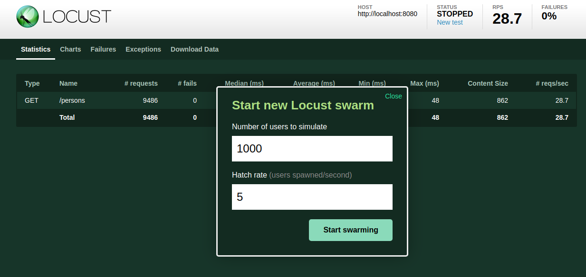
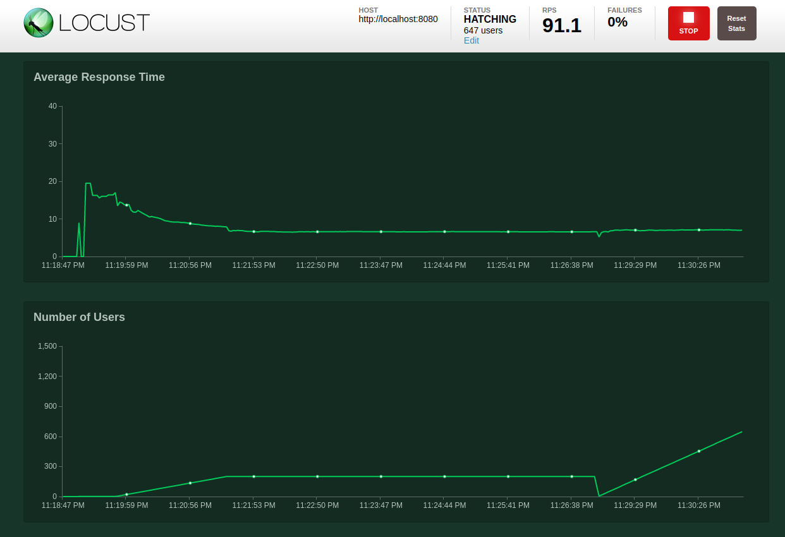

# Testing locust.io

## Quick start

Just run locust by performing the following command in a command shell:
```
locust --host=http://localhost:8080
```

This will start locust using the python script ___locustfile.py___

After starting navigate the web browser to

[127.0.0.1:8089](http://127.0.0.1:8089)

Then you will see the following screen. 
Here you specify 

* the number of maximum users to simulate
* how many new users are ramped up per second 



After pressing _Start swarming_ button you can just watch the statistics or charts
 like the following:



There are many more options for locust

```
locust --help
```

For writing a locust python file just look into the [reference docs](https://docs.locust.io/en/stable/writing-a-locustfile.html#). 
